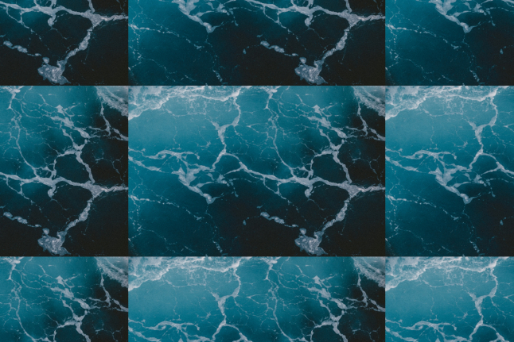

# andris.tiler.ofx
OpenFX plugin that produces a tile effect with an adjustable offset and scaling.

Input | Output
----- | -----
 | 

Photo by Jakob Owens on Unsplash

## Dependencies
* [OpenFX](https://github.com/ofxa/openfx)
* [OpenCV](https://github.com/opencv/opencv)
* [andris.ofx.util](https://github.com/ch200c/andris.ofx.util)

## How to build (Windows)
* Clone the repository.
* Run `cmake` in this project's root directory with
    * `-DOPENFX_DIR:PATH` pointing to the root directory of OpenFX source
    * `-DOPENFX_SUPPORT_LIB:FILEPATH` pointing to the OpenFX support lib file
    * `-DOpenCV_DIR:PATH` pointing to the directory where you have built OpenCV
    * `-Dandris.ofx.util_DIR:PATH` pointing to the directory where you have built andris.ofx.util
* Open the generated solution file and build the project.

## How to use (Windows)
### Installing the plugin
* Copy `opencv_imgproc*.dll` and `opencv_core*.dll` from your OpenCV build and `andris.ofx.util.dll` from your andris.ofx.util build to your host directory (e.g. `C:/Program Files/Blackmagic Design/DaVinci Resolve`).
* Rename `andris.tiler.ofx.dll` to `andris.tiler.ofx` and copy it to `%SystemDrive%/Program Files/Common Files/OFX/Plugins/andris.tiler.ofx.bundle/Contents/Win64`. You will need to create the directory if it does not exist.

### Uninstalling the plugin
* Delete `%SystemDrive%/Program Files/Common Files/OFX/Plugins/andris.tiler.ofx.bundle/Contents/Win64/andris.tiler.ofx`.

## Acknowledgements
CMake files adapted from [how-to-export-cpp-library](https://github.com/robotology/how-to-export-cpp-library).